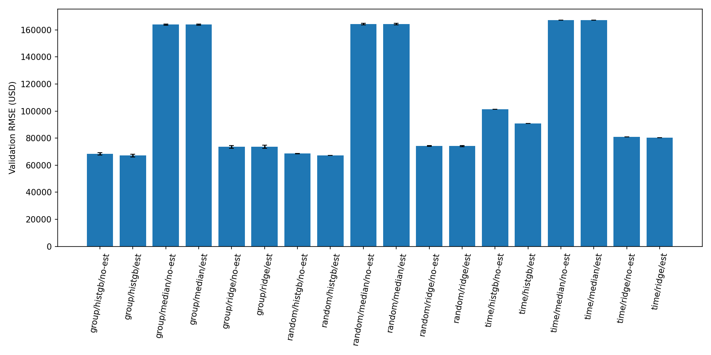

# 房价预测项目改进报告

本次按照《KV与房价预测项目提升计划》完成验证可信度、基线、消融、质量检查、误差解释和可复现产物。旧随机验证结果得到精确复现，但新实验表明：模型在新房产上的表现较稳定，跨年份预测能力较弱。改进的主要价值是把这些边界量化，而非只追求更低的单次分数。

## 原状与本次改动

原有 `proj.py` 已能训练 HistGradientBoosting 并导出预测，但只有一次随机 80/20 划分，缺少防止同一房产同时出现于两侧的检查；代码没有输入契约、完整评估报告和自动测试。

| 改进 | 实现 | 能解决的问题 |
|---|---|---|
| PIN 分组验证 | `evaluate.split_indices(..., 'group')` | 同一 PIN 的全部交易记录放在同一侧 |
| 时间验证 | 2019 留出，并从 2013–2018 训练集剔除留出 PIN | 检验未来年份的新房产；不把同房产历史混入训练 |
| 三档基线 | Median、Ridge、HistGB | 判断复杂模型相对简单方法的实际增益 |
| 估值消融 | `include_estimates=False` | 同时排除原始和衍生估值特征，模型预测不需要估值列 |
| 质量报告 | `data_quality.json`、`splits.json` | 缺失率、重复行、重复 PIN、无效价格、未知类别和重叠检查 |
| 误差解释 | `grouped_errors.csv`、两个 importance CSV | 按价格带、房型编码和镇区编码定位误差 |
| 工程化 | schema、CLI、日志、哈希、锁定版本、6 项测试 | 错误输入尽早失败，实验可追溯、模型可重新加载 |

## 数据与切分证据

训练集共 138,217 行、62 列、120,648 个不同 PIN；重复 PIN 行为 17,569，完整重复行 7。当前已过滤课程数据的各列缺失率均为 0，无价格低于 500 或非有限价格的样本；这不意味着真实部署数据也如此。为复现原始基线，保留重复记录；重复 PIN 本身可以是合法的多次交易。

| 切分 | 训练行 | 验证行 | 两侧 PIN 重叠 | 说明 |
|---|---:|---:|---:|---|
| 随机，seed 42 | 110,573 | 27,644 | 5,382 | 行索引无重叠，房产有重叠 |
| PIN 分组，seed 42 | 110,596 | 27,621 | 0 | 按房产切分，所以行数不必恰为 20% |
| 时间，2019 留出 | 113,898 | 20,199 | 0 | 剔除早期同 PIN 记录 4,120 行 |

随机与分组分别运行 seeds 42、43、44；时间边界固定，因此只跑一次，避免重复同一切分伪装成独立验证。每个切分都检查行位置无重叠；只有随机切分保留 PIN 重叠，作为原始方法的对照。每次划分的行位置与输入 SHA-256 均已保存。

## 三档模型与消融

以下随机/分组为三次均值；时间为一次固定年份实验。RMSE、MAE 单位是美元。所有模型以自然对数价格为目标；Ridge 使用 one-hot 和数值标准化，HistGB 保留原有 ordinal 类别编码，原始特征范围一致。

| 验证 | 模型 | 估值 | RMSE | MAE | log-RMSE |
|---|---|---|---:|---:|---:|
| 随机 | Median | 有/无 | 164,301 | 123,110 | 0.7866 |
| 随机 | Ridge | 有 | 74,103 | 51,100 | 0.3611 |
| 随机 | HistGB | 有 | 67,208 | 47,137 | 0.3469 |
| 随机 | HistGB | 无 | 68,630 | 47,819 | 0.3485 |
| PIN 分组 | Median | 有/无 | 163,923 | 122,518 | 0.7801 |
| PIN 分组 | Ridge | 有 | 73,590 | 50,847 | 0.3577 |
| PIN 分组 | Ridge | 无 | 73,625 | 50,912 | 0.3576 |
| PIN 分组 | HistGB | 有 | 67,116 | 47,029 | 0.3438 |
| PIN 分组 | HistGB | 无 | 68,366 | 47,698 | 0.3456 |
| 时间 | Median | 有/无 | 167,151 | 122,900 | 0.7198 |
| 时间 | Ridge | 有 | 80,313 | 58,779 | 0.3985 |
| 时间 | Ridge | 无 | 81,016 | 59,576 | 0.4015 |
| 时间 | HistGB | 有 | 90,923 | 70,862 | 0.4923 |
| 时间 | HistGB | 无 | 101,220 | 78,109 | 0.5169 |

完整 42 次结果见 `artifacts/metrics.csv`，含每次模型的运行耗时和样本数。旧 seed 42 的 HistGB log-RMSE=0.3461350280、RMSE=67,211.1439，复现了上一版结果。

PIN 分组 HistGB 相对 Ridge 的平均 RMSE 低约 8.8%。分组三次 RMSE 的样本标准差约 947 美元。去掉估值后 RMSE 增加约 1,251 美元（1.86%）；这说明仍有其他有用信号，不能据此断言估值没有信息泄漏。

时间实验中 Ridge 优于 HistGB：年份类别在未来可能未出现，树模型难以外推，市场分布也可能变化。这些是合理解释，不是本次已证明的因果归因。继续保留 HistGB 为课程数据最终模型；若目标是未来年份部署，应重新选择模型并审计特征的时点可用性。



## 哪些样本更难

PIN 分组 seed 42、有估值 HistGB 的价格带结果如下。价格带由真实标签决定，仅用于事后诊断，没有回流为训练特征。

| 真实价格 | 样本数 | MAE | RMSE | log-RMSE |
|---|---:|---:|---:|---:|
| <100k | 5,133 | 28,511 | 42,558 | 0.5213 |
| 100k–250k | 11,793 | 39,258 | 52,081 | 0.3258 |
| 250k–500k | 8,375 | 55,997 | 74,510 | 0.2444 |
| 500k–1m | 2,320 | 102,573 | 132,490 | 0.2693 |

高价房的美元误差更大；低价房的相对误差更大。此验证集没有超过 1m 的样本，因此不能宣传豪宅泛化能力。镇区编码 73（185 行）和 10（168 行）RMSE 约为 118,352、113,808；房型编码 206（719 行）为 110,204。编码仅作为原始分组标签，没有自行猜测真实区域名称。小组样本量及房价分布不同，不能把这些指标当作公平性结论。

Permutation importance 在分组验证集抽取 1,500 行、重复打乱 3 次，以 log-RMSE 增量衡量。前列包括建筑估值、纬度、土地估值、Most Recent Sale、经度和年份。单列打乱反映已拟合模型的依赖；相关特征可互相替代，因此不能与重新训练的消融增益直接等同，也不是因果解释。

## 重要边界与上一版修正

1. 官方估值是否在预测时已知，需要独立的 as-of 审计。本地字典说明来自上一税年，不能据此保证每条记录没有未来信息。
2. `Most Recent Sale` 是回溯性标志，可能使用未来交易信息，而且在 importance 中靠前。当前课程模型不能直接作为交易发生前的在线模型。无估值消融没有同时移除此标志，应准确描述实验范围。
3. 随机/分组验证分数接近，不代表重复房产永远无害；本次三次切分只是稳定性证据，不是独立置信区间。
4. 55,311 行预测对应下载自 Berkeley DS-100/fa22 的公开测试数据。尚未确认该数据等同于本地 ECE 课程的正式评分数据。上一版把“成功生成预测”表述为“正式竞赛数据已核验”证据不足，在此更正。训练与该测试集有 12,325 个 PIN 重叠，且测试标签缺失，不能计算真实官方测试分数或排名。
5. 7 条完整重复记录未删除，以保持与旧基线同口径；未来另做去重敏感性分析时应单独标记实验版本。

## 运行与产物

在 Part 2 目录，以 Python 3.12 执行：

```powershell
pip install -r requirements.txt
python -m unittest -v test_pipeline
python evaluate.py --seeds 42 43 44 --output artifacts
```

最终模型默认用全量有效训练行拟合，输出 `artifacts/pipeline.joblib.gz` 和 `artifacts/predictions.csv`。预测仍为 log(Sale Price)，保留课程原格式的索引列。`--without-estimates` 控制最终模型不依赖估值；`--train`、`--test` 可指向重新确认的数据文件。旧 `train_part2.py` 保留简单训练入口。

6 项自动测试覆盖 PIN 隔离、时间隔离、schema 拒绝缺列/非有限值、特征处理不修改输入及小数浴室数、未知类别/缺失值/无估值与序列化，以及无效目标和指标。测试全部通过；导出前检查预测长度和有限值，并验证重新加载模型的结果一致。

面试讲解可依次说明：为什么预测 log(price)、为什么不能只随机划分、为什么需要 Median 和 Ridge、估值消融说明什么、为什么未来年份结果更差、哪些信息不能在线获得。按计划已到达停止线，本次未添加 Web 前端、云部署或没有验证依据的简历数字。
